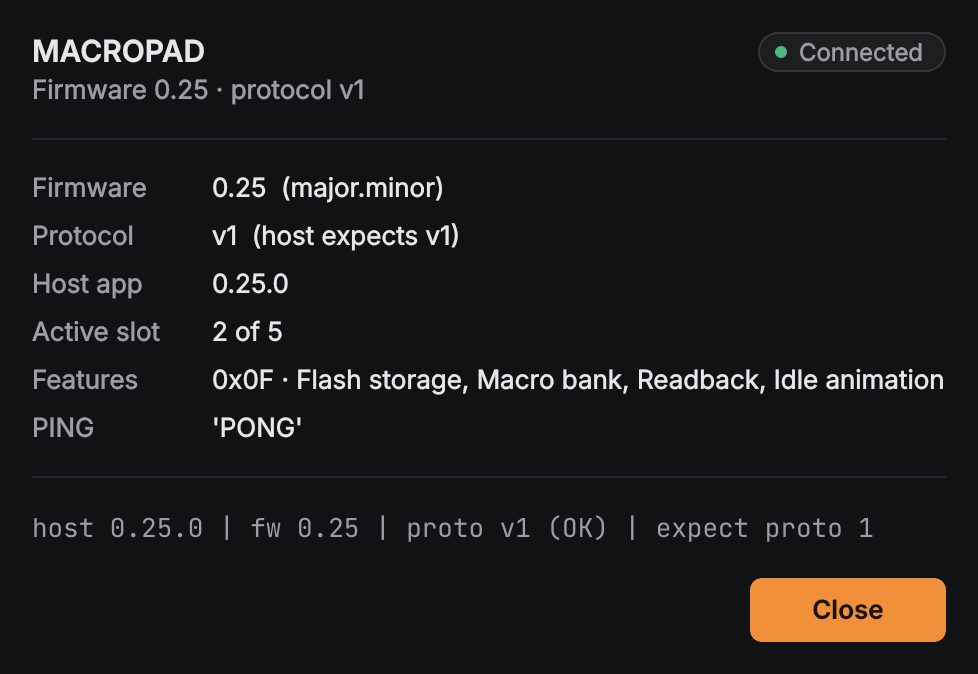
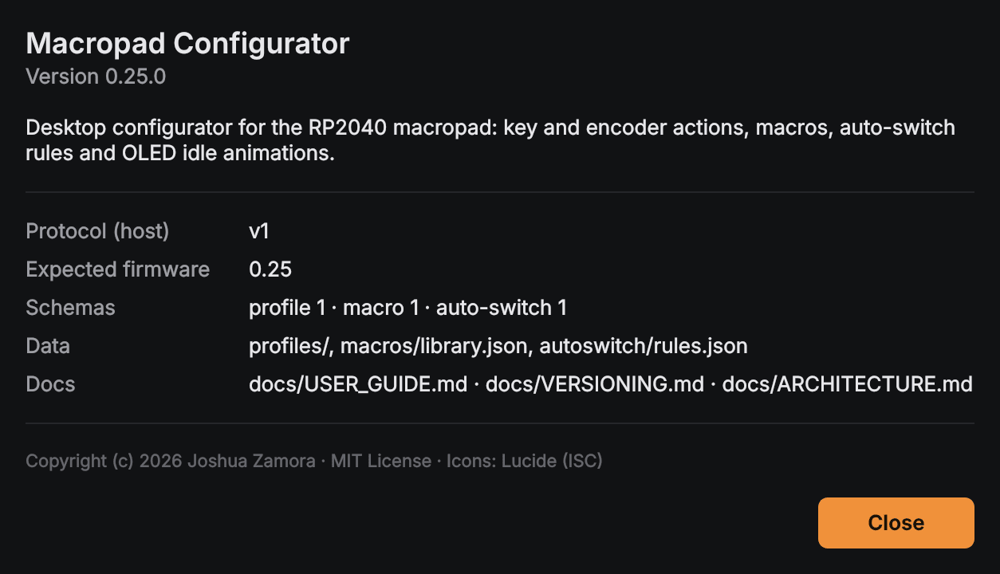
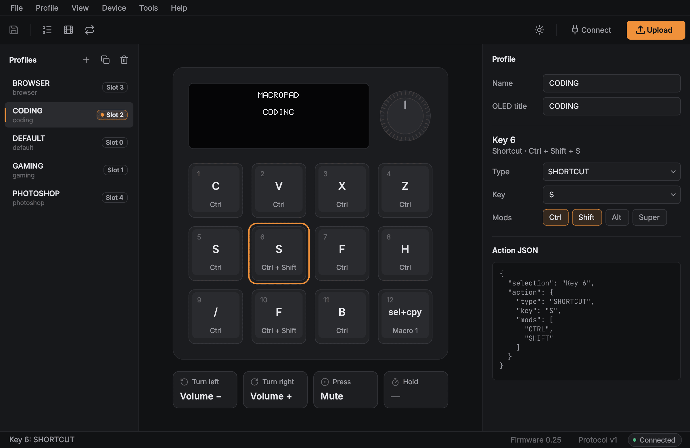
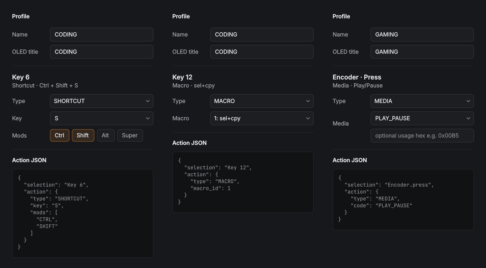
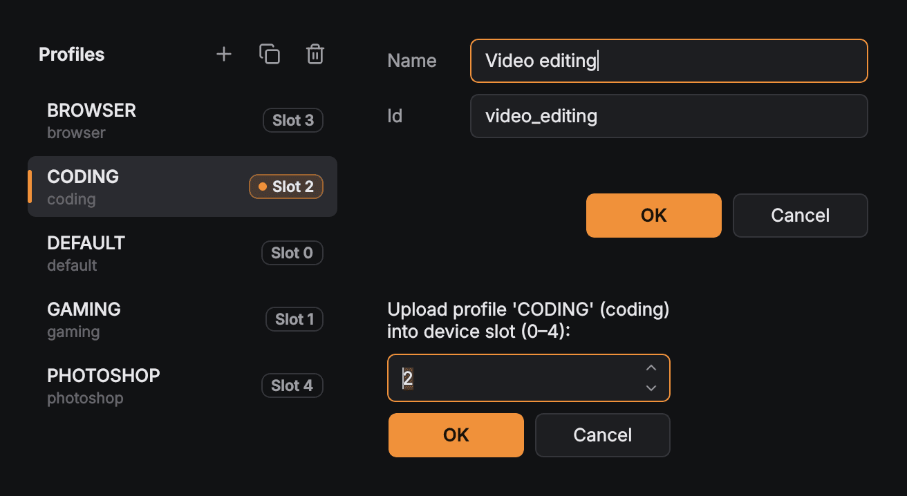
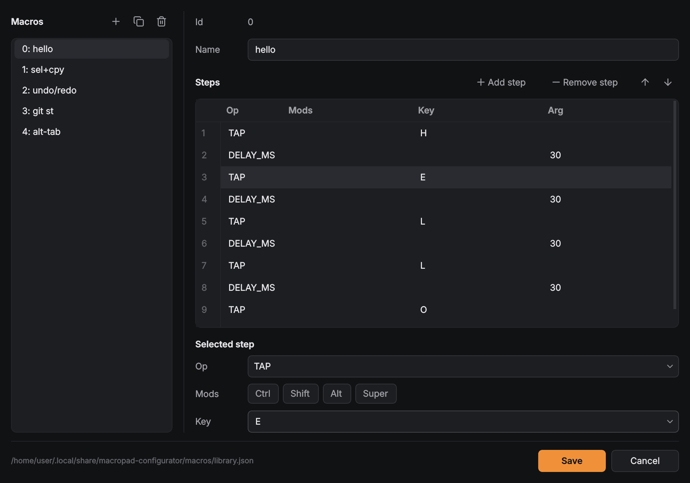
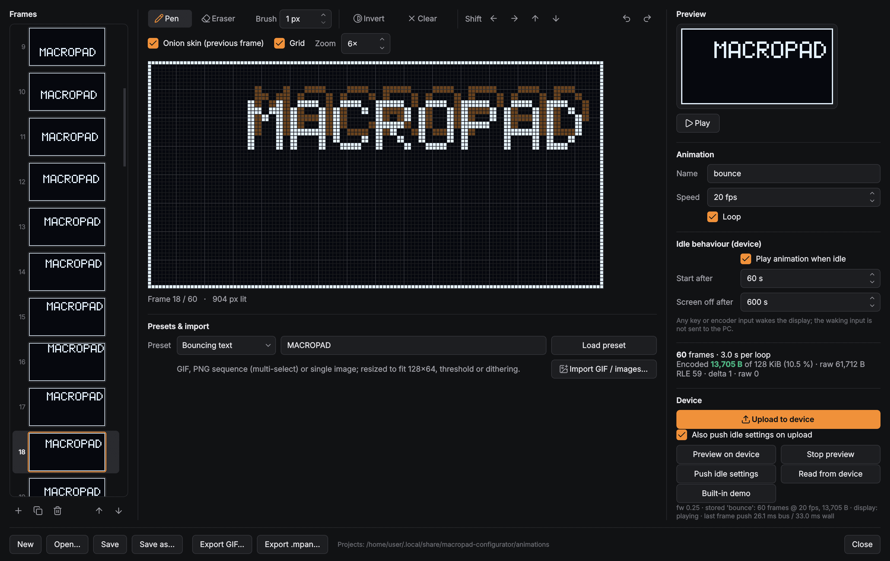
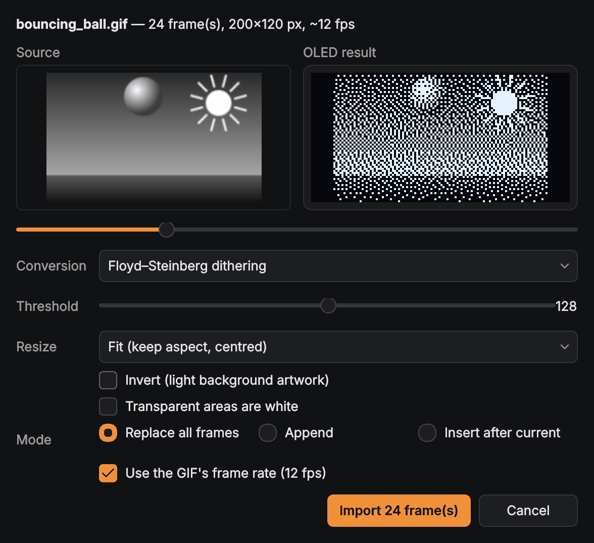
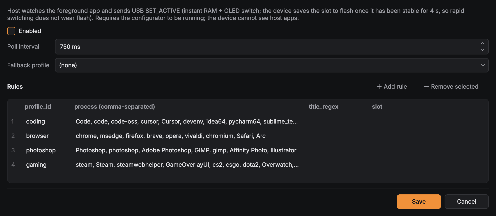

# User guide

This guide takes you from a bag of parts and a release download to a working, configured
macropad. It covers firmware **0.25** and Macropad Configurator **0.25.0**. Every number here
comes from the firmware and configurator source; if you find one that does not match, please
open an issue.

Something not working? See [TROUBLESHOOTING.md](TROUBLESHOOTING.md).

**Contents**

1. [What you need](#what-you-need)
2. [Wiring](#wiring)
3. [Flash the firmware](#flash-the-firmware)
4. [Install the configurator](#install-the-configurator)
5. [First connection](#first-connection)
6. [Using the macropad](#using-the-macropad)
7. [Editing key and encoder actions](#editing-key-and-encoder-actions)
8. [Profiles](#profiles)
9. [Macro library](#macro-library)
10. [Idle animations](#idle-animations)
11. [Auto-switch rules](#auto-switch-rules)
12. [Where your data lives](#where-your-data-lives)
13. [Backing up and restoring](#backing-up-and-restoring)
14. [Updating the firmware](#updating-the-firmware)
15. [Command-line options](#command-line-options)

---

## What you need

| Part | Notes |
|------|-------|
| **Waveshare RP2040-Zero** | The firmware is built for this board (2 MiB flash, USB-C). Only edge pins are used. |
| **12 × MX-style switches** | Wired as a 3 × 4 matrix (3 rows, 4 columns). |
| **12 × diodes** | One per switch, e.g. 1N4148. Without them, pressing several keys at once produces ghost key presses. |
| **KY-040 rotary encoder module** | Or a bare EC11 encoder with push switch. The firmware counts 4 quadrature transitions per detent. |
| **SSD1306 OLED, 128 × 64, I2C** | The common 0.96″ module. Address **0x3C** (the firmware falls back to **0x3D**). |
| USB-C cable | Data-capable, not charge-only. |
| Wire, solder, a case | The PCB and enclosure are not part of this project yet. |

From the [Releases page](https://github.com/joshua12-5/macropad/releases), download:

- `macropad-fw-X.Y.Z.uf2`, plus `macropad-fw-X.Y.Z.uf2.sha256` so you can check it;
- the configurator for your computer:
  - Windows 10/11 x64: `MacropadConfigurator-X.Y.Z-windows-x64.zip`
  - macOS 12 or newer, Apple Silicon: `MacropadConfigurator-X.Y.Z-macos-arm64.zip`
  - macOS 12 or newer, Intel: `MacropadConfigurator-X.Y.Z-macos-x86_64.zip`
  - Linux x86_64 with glibc 2.35 or newer (Ubuntu 22.04+, Debian 12+, Fedora 36+):
    `macropad-configurator-X.Y.Z-linux-x86_64.tar.gz`
- `SHA256SUMS.txt`, which covers every file in the release.

## Wiring

The pin map is fixed in the firmware (`firmware/include/board_pins.h`). Use the GP numbers
printed on the RP2040-Zero.

| Function | RP2040-Zero pin | Connects to |
|----------|-----------------|-------------|
| Row 1 | **GP8** | keys 1–4 (through their diodes) |
| Row 2 | **GP9** | keys 5–8 |
| Row 3 | **GP10** | keys 9–12 |
| Column 1 | **GP11** | keys 1, 5, 9 |
| Column 2 | **GP12** | keys 2, 6, 10 |
| Column 3 | **GP13** | keys 3, 7, 11 |
| Column 4 | **GP14** | keys 4, 8, 12 |
| Encoder A | **GP2** | KY-040 `CLK` |
| Encoder B | **GP3** | KY-040 `DT` |
| Encoder switch | **GP15** | KY-040 `SW` (bare EC11: switch between GP15 and GND) |
| OLED SDA | **GP4** | SSD1306 `SDA` (I2C0) |
| OLED SCL | **GP5** | SSD1306 `SCL` (I2C0) |
| Power | **3V3**, **GND** | KY-040 `+` / `GND`, SSD1306 `VCC` / `GND` |
| Onboard RGB LED | GP16 | on the board itself; the firmware does not drive it |
| Debug UART (optional) | GP0 TX, GP1 RX | 115200 baud, 3.3 V logic; boot and event log |

Key numbers as the configurator shows them:

```
OLED                ENCODER
 1   2   3   4       (row 1, GP8)
 5   6   7   8       (row 2, GP9)
 9  10  11  12       (row 3, GP10)
```

**Matrix and diodes.** The firmware scans COL2ROW: it drives one row low at a time and reads
the columns through internal pull-ups. For every switch, one leg goes to its **column** wire.
The other leg goes to a diode's **anode**, and the diode's **cathode** (the end with the band)
goes to the **row** wire.

**Encoder.** The firmware enables internal pull-ups on GP2, GP3 and GP15, so a bare EC11 works
without resistors (wire its common pin `C` to GND). Power the KY-040 from **3V3, not 5 V**, because the RP2040's pins are not
5 V tolerant. If the knob turns the wrong way, swap the `CLK` and `DT` wires, or swap the
**Turn left** and **Turn right** actions in the configurator.

**OLED.** Power it from 3V3. At boot the firmware probes 0x3C, then 0x3D, and runs the bus at
400 kHz.

## Flash the firmware

1. **Check the download** (optional, recommended). Run the command from the folder that
   holds the `.uf2` and its `.sha256` file:
   - Linux: `sha256sum -c macropad-fw-0.25.0.uf2.sha256`
   - macOS: `shasum -a 256 -c macropad-fw-0.25.0.uf2.sha256`
   - Windows (PowerShell): `Get-FileHash .\macropad-fw-0.25.0.uf2 -Algorithm SHA256`, then
     compare the hash with the first word of the `.sha256` file.

   `SHA256SUMS.txt` works the same way for every release file:
   `sha256sum -c SHA256SUMS.txt --ignore-missing`.
2. **Enter the bootloader.** Hold the **BOOT** button on the RP2040-Zero while you plug in the
   USB cable, then let go. If the board is already plugged in, hold **BOOT**, tap **RESET**, and
   release **BOOT**. A USB drive called **`RPI-RP2`** appears.
3. **Copy the UF2** (drag and drop) onto `RPI-RP2`. The board reboots by itself when the copy
   finishes and the drive disappears. That is expected, so ignore any "disk not ejected
   properly" warning.
4. The OLED shows a boot screen for about 1.5 s, then the active profile's title. Your computer
   now sees a keyboard called **RP2040 Macropad** (USB VID `0x2E8A`, PID `0xC001`). No driver is
   needed on any OS.

Flashing a new UF2 does not erase your profiles, macros, idle settings or animation. They live
in a separate part of the flash; see [Updating the firmware](#updating-the-firmware).

## Install the configurator

The configurator builds are **not code-signed**, so each OS shows a warning the first time.

### Windows

1. Right-click the zip → **Properties** → tick **Unblock** → **OK**. (This is optional, but it
   avoids SmartScreen prompts for every file inside.)
2. Extract the **whole** zip. Running the app from inside the zip viewer fails.
3. Run `MacropadConfigurator\MacropadConfigurator.exe`. If SmartScreen says *"Windows protected
   your PC"*, click **More info → Run anyway**.

### macOS

1. Unzip and move **MacropadConfigurator.app** to **Applications**.
2. Open it once. Gatekeeper refuses because the app is only ad-hoc signed ("Apple cannot check
   it for malicious software", or on some versions "is damaged"). To allow it:
   - macOS 14 and earlier: Control-click the app → **Open** → **Open**.
   - macOS 15 and later: open it once, then go to **System Settings → Privacy & Security**, find
     *"MacropadConfigurator" was blocked* and click **Open Anyway**.
   - Or, from Terminal: `xattr -dr com.apple.quarantine /Applications/MacropadConfigurator.app`
3. Auto-switch asks the **System Events** app for the frontmost window. The first time you
   enable it, macOS may ask whether the configurator may control System Events. Allow it, or
   auto-switch cannot see which app is active.

### Linux

```bash
tar xzf macropad-configurator-0.25.0-linux-x86_64.tar.gz
cd macropad-configurator-0.25.0-linux-x86_64
./install.sh            # installs the udev rule (asks for sudo) + a desktop launcher
# unplug and replug the macropad
./MacropadConfigurator/MacropadConfigurator
```

**The udev rule matters.** Without it the app starts, but **Device → Connect** fails with
"permission denied" on `/dev/hidraw*`. The tarball ships the rule as `70-macropad.rules`. The
same file is in the repo at [`packaging/linux/70-macropad.rules`](../packaging/linux/70-macropad.rules):

```
KERNEL=="hidraw*", ATTRS{idVendor}=="2e8a", ATTRS{idProduct}=="c001", MODE="0660", TAG+="uaccess"
```

To install it by hand:

```bash
sudo install -m 0644 70-macropad.rules /etc/udev/rules.d/
sudo udevadm control --reload-rules && sudo udevadm trigger
```

Then replug the macropad. On X11, Qt needs `libxcb-cursor0` (Debian/Ubuntu) or
`xcb-util-cursor` (Fedora). Auto-switch on Linux uses `xdotool`, so install it if you want that
feature. See [Auto-switch rules](#auto-switch-rules) for Wayland.

### Running from source (any OS)

```bash
cd configurator
python3 -m venv .venv && source .venv/bin/activate    # Windows: .venv\Scripts\activate
pip install -r requirements.txt                        # PySide6 + hidapi (native lib included)
python -m macropad_config
```

From source, the app edits the repo's `profiles/`, `macros/library.json` and
`autoswitch/rules.json` directly. Linux still needs the udev rule above.

## First connection



1. Plug in the macropad and start the configurator.
2. Choose **Device → Connect / Get device info** (`Ctrl+Shift+I`). The app opens the macropad's
   configuration interface (a separate HID interface with usage page `0xFF00`, next to the
   keyboard) and shows:
   - **Host app** and **Firmware** versions. The minor numbers should match: host `0.25.0` goes
     with firmware `0.25`.
   - **Protocol** version. It must be equal on both sides (currently **1**). If it differs, the
     app shows a warning and keeps the upload, save and auto-switch actions disabled until you
     update one side.
   - **Active slot** (0–4) and **slot count** (5).
3. The right end of the status bar keeps a quiet summary: a **Connected** pill, the firmware
   version and the protocol version. Features that need newer firmware than you
   have are greyed out with a tooltip. For example, idle animations need firmware 0.25.

**Help → About** shows the configurator version, the protocol and firmware versions it expects,
and the schema versions.



## Using the macropad

- **Keys** fire their action on press. KEY and SHORTCUT actions are **held** for as long as you
  hold the key, so the OS's own key repeat works. Up to 6 held keys are reported at once, and
  their modifiers combine.
- **Encoder:** each detent fires the Turn right (clockwise) or Turn left (counter-clockwise)
  action once, and a short press fires the Press
  action.
- **OLED:** shows the active profile's title, plus short pop-ups for key presses ("Key 6"),
  volume ("VOL UP", with an estimated level; the macropad cannot read your real system volume),
  mute, media and profile changes.
- **On-device profile menu:**
  - **Hold the knob for about 0.8 s** to open the menu. The OLED lists the five slots (four
    rows visible at a time).
  - **Turn** to move the highlight; it wraps around.
  - **Short-press** to switch to the highlighted profile.
  - **Hold again**, or wait **9 s** without turning, to cancel. The profile stays unchanged.
  - Keys are ignored while the menu is open.

> A profile picked on the device, or by a PROFILE key, is active straight away but is **not
> saved to flash by itself**. After a power cycle the macropad starts on the last *saved* slot.
> To keep your choice, use **Device → Save device state**. Any profile or macro upload,
> **Push idle settings**, or a slot change from auto-switch also saves the current slot.

## Editing key and encoder actions



The main window has three columns:

- **Left:** the profile list. Each row shows the profile name and id, plus a **Slot N** badge
  when the configurator knows which device slot holds it; the active slot has an accent dot.
  The **+**, copy and trash icons above the list create, duplicate and delete profiles.
- **Middle:** a drawing of the macropad: the OLED (showing the profile's idle title), the knob
  and the 12 keycaps, each labelled with its action. Below it are the four encoder slots
  **Turn left**, **Turn right**, **Press** and **Hold** (hold = long press).
- **Right:** the inspector: the profile's **Name** and **OLED title**, the selected key or slot
  with its **action editor**, and a read-only JSON view of the action.

Click a keycap, the knob or an encoder slot (or move between keys with the arrow keys), then
pick a **Type**. Only the fields that type uses are shown.
Changes apply to the profile in memory straight away and the status bar says *Modified*.
**File → Save** (`Ctrl+S`) writes the current profile to disk and **File → Save All**
(`Ctrl+Shift+S`) writes every changed profile. To put changes on the macropad, use
**Device → Upload profile to device…** or the **Upload** button in the toolbar (see
[Profiles](#profiles)).

The toolbar also has Save, the macro library, the idle animation editor, auto-switch rules,
**Connect**, and a sun / moon button that flips between the dark and light theme.
**View → Theme** chooses **Match system** (the default), **Dark** or **Light**; the choice is
remembered. **View → Toggle dark / light** (`Ctrl+Shift+L`) does the same as the toolbar
button.



These are the action types the firmware supports (`firmware/include/profile_schema.h`):

| Type | Fields | What the macropad does |
|------|--------|------------------------|
| `DISABLED` | none | Nothing. |
| `KEY` | Key | Sends one key. On a key, it is held while pressed; on the encoder, it is tapped. |
| `SHORTCUT` | Key + Mods (`CTRL`, `SHIFT`, `ALT`, `GUI`) | The key with modifiers, e.g. Ctrl+Shift+S. `GUI` is the Windows / Command / Super key. Held or tapped like KEY. |
| `MACRO` | Macro (id 0–4) | Plays that macro from the device's macro bank (see [Macro library](#macro-library)). |
| `TEXT` | Text id 0–7 | Types a built-in string (table below). |
| `URL` | Text id 0–7 | Types the string, then presses Enter. |
| `APP` | Text id 0–7 | Types the string, then presses Enter. This is best-effort: it only launches something if a Run box, launcher or terminal already has focus. |
| `MEDIA` | Media name, or a raw consumer usage in hex | Sends a media key: `PLAY_PAUSE`, `NEXT` / `SCAN_NEXT`, `PREV` / `SCAN_PREV`, `STOP`, `MUTE`, `VOLUME_UP`, `VOLUME_DOWN`, or any usage such as `0x00B5`. |
| `VOLUME` | `up` / `down` / `mute` | System volume up, down or mute, with an OLED pop-up. |
| `PROFILE` | Slot 0–4 (the optional profile id is just a label) | Switches the active profile slot. Only the **slot number** reaches the device. |

**Keys you can pick:** A–Z, 0–9, F1–F12, ENTER, SPACE, TAB, ESC, BACKSPACE, DELETE, the arrow
keys and ``/ - = [ ] \ ; ' , . ` ``. The Key box is editable, so you can also type a raw HID usage
number (decimal or `0x..`).

**Built-in strings** for TEXT / URL / APP, and for macro TEXT steps. These are compiled into the
firmware (`firmware/src/text_table.c`) and cannot be edited from the configurator:

| Text id | String |
|---------|--------|
| 0 | `Hello` |
| 1 | `https://github.com/joshua12-5/macropad` |
| 2 | `git status` + Enter |
| 3 | `console.log(` |
| 4 | `notepad` |
| 5 | `calc` |
| 6 | `Hello, World!` |
| 7 | `ls -la` + Enter |

How typing behaves:

- Strings are typed as **US-QWERTY** key presses. With another keyboard layout active on the
  computer, some symbols come out differently.
- Characters that have no key are skipped.
- Typing does not block the macropad. Up to 7 pending TEXT / URL / APP and one-shot key actions
  wait their turn; further ones are dropped.
- While a string or macro is being typed, held KEY / SHORTCUT keys are not reported.

**The encoder's Long slot** is saved in the profile but never fires, because holding the knob
opens the profile menu.

## Profiles



The macropad holds **five profile slots (0–4)**. The configurator can keep any number of
profiles on your computer (one JSON file each) and you choose which five go onto the device.

| Task | How |
|------|-----|
| New profile | **Profile → New…** (`Ctrl+N`) or the **+** icon above the profile list. Enter a Name; the Id is filled in from it and can be edited. Ids must be unique and match `^[a-z][a-z0-9_]*$`. A new profile has all keys `DISABLED` and the encoder set to volume up / down / mute. |
| Duplicate | **Profile → Duplicate…** (`Ctrl+D`): copies the selected profile under a new name and id. |
| Delete | **Profile → Delete…**: asks first, then removes the JSON file if it was saved. |
| Rename / OLED title | The **Name** and **OLED title** fields on the right. The device stores up to **15 characters** of each. The OLED title is what the macropad shows. |
| Open another folder | **File → Open profiles folder…** (`Ctrl+O`); **File → Reload** (`Ctrl+R`). |
| Send to the macropad | **Device → Upload profile to device…** (`Ctrl+Shift+U`) uploads the **selected** profile into the slot (0–4) you pick, and saves it to flash immediately. The suggested slot is the device's active slot, or 0–4 for the bundled ids `default`, `gaming`, `coding`, `browser`, `photoshop`. |
| Switch profiles | On the device: hold the knob (see [Using the macropad](#using-the-macropad)). From a key: a `PROFILE` action. From the computer: [auto-switch](#auto-switch-rules), which sends `SET_ACTIVE`. |
| Save the active slot now | **Device → Save device state** writes profiles, macros, the active slot and idle settings to flash at once (`SAVE_ALL`). |

A fresh board starts with five factory profiles: DEFAULT, GAMING, CODING, BROWSER and PHOTOSHOP
(slots 0–4). The bundled JSON files in `profiles/` use the same five ids.

`SET_ACTIVE` (used by auto-switch) changes the profile in RAM and on the OLED at once. The
device then writes the new slot to flash only after it has stayed unchanged for **4 s**, and it
skips the write when flash already holds that slot. Frequent switching therefore does not wear
out the flash.

## Macro library



**Profile → Macro library…** edits the macro library file (`macros/library.json`). Each macro
has an **id**, a **name** and a list of **steps**. On the left: the macro list with
new / duplicate / delete icons. On the right: the Name, the steps table (**Add step**,
**Remove step**, and up / down arrows to reorder) and a **Selected step** editor that shows only
the fields the selected op uses. **Save** writes the file; **Cancel**
asks before discarding changes.

| Op | Fields | Effect |
|----|--------|--------|
| `TAP` | Mods, Key | Press and release the key with modifiers, plus any modifiers held by earlier `KEY_DOWN` steps. |
| `KEY_DOWN` | Mods, Key | Press and **hold** (a key and/or modifiers) until a matching `KEY_UP` or the end of the macro. |
| `KEY_UP` | Mods, Key | Release that key / those modifiers. Empty key and no mods releases **everything**. |
| `DELAY_MS` | Delay 0–65535 ms | Wait. |
| `TEXT` | Text id 0–7 | Type a built-in string (see the table above). |
| `CONSUMER` | Preset or usage hex (e.g. `0x00CD`) | Send one media / consumer key. |
| `END` | none | End of the macro; releases anything still held. Always the last step. |

Device limits and behaviour:

- **5 macro slots, ids 0–4.** Only library ids 0–4 are uploaded; other ids stay on your
  computer.
- **24 steps** per macro, including the final `END`. Longer macros fail to upload.
- Names: **15 characters**.
- Only **one macro plays at a time**. Triggering another while one is running is ignored.

**Device → Upload macros to device…** (`Ctrl+Shift+M`) uploads ids 0–4 to RAM and flash in one
go and reports how many were sent. Until you upload, the macropad keeps the macros it already
had; a fresh board has the five factory macros (`hello`, `sel+cpy`, `undo/redo`, `git st`,
`alt-tab`). A key uses a macro through a `MACRO` action with that id.

## Idle animations



After a period with no input, the OLED can play your own 128 × 64 animation, and later switch
the panel off to protect it from burn-in. Open the editor with **Tools → Idle animation…**.
Editing works offline; the device buttons need **firmware 0.25 or newer**. With older firmware
the editor tells you which firmware to flash and sends nothing.

### How it behaves on the device

| Setting (editor label) | Default | Range | Meaning |
|------------------------|---------|-------|---------|
| **Play animation when idle** | on | on / off | Play the animation when idle. Screen-off still applies when this is off. |
| **Start after** | 60 s | 0–65535 s, **0 = never** | Time without key or encoder input before the animation starts. |
| **Screen off after** | 600 s | 0–65535 s, **0 = never** | Time without input before the display switches off. It counts from your last input, not from when the animation started. |

- With no animation uploaded, the macropad plays a built-in starfield.
- **The input that wakes the display is swallowed.** A key press, encoder turn or encoder press
  only brings back the normal screen: nothing is sent to the computer and no action fires. A
  waking key starts working again once you release it and press it again. A waking knob press
  does not open the profile menu either.
- The animation plays at its own speed (**1–30 fps**) and either loops or stops on its last
  frame.
- Settings and the animation survive power cycles.

### Making an animation

- **Frames:** the thumbnail strip on the left. The icons below it add, duplicate (`Ctrl+D`),
  delete and move the frame earlier / later (up / down arrows); you can also drag to reorder.
  `[` and `]` step through frames.
- **Canvas:** Pen (`P`) and Eraser (`E`); the right mouse button does the opposite. Brush size
  1–8 px, Invert (`I`), Clear, Shift left / right / up / down (wraps around), onion skin of the previous frame,
  grid, zoom 2–12×, Undo / Redo (`Ctrl+Z` / `Ctrl+Y`).
- **Preview:** **Play** / **Pause** (`Space`) at the chosen speed.
- **Presets:** *Starfield (warp)*, *Bouncing text* (default text `MACROPAD`), *Scrolling text*
  (your own text) and *Pulse / breathing*. Pick one, then **Load preset**.
- **Name:** up to **8 characters**. That is all the device stores.
- **Files:** **Save / Save as… / Open…** store projects as `*.mpanim.json` in the `animations`
  folder of your [data folder](#where-your-data-lives). **Export GIF…** writes a preview GIF and
  **Export .mpan…** writes the exact file the device stores.
- The stats line shows the encoded size against the device's **128 KiB** animation space. At
  least **127 frames** always fit, even worst-case noise. Simple line art fits several hundred
  frames, up to the format's cap of **1024**.

### Importing a GIF or images



**Import GIF / images…** accepts an animated GIF, a sequence of PNG / JPEG / BMP / WebP files
(multi-select; sorted naturally, so `f2` comes before `f10`) or a single image.

- **Resize:** each image is **fitted** into 128 × 64 keeping its shape, centred on black, or
  **stretched**.
- **Conversion:** images are turned into black-and-white pixels by **Floyd–Steinberg
  dithering** (best for photos) or by a **threshold** slider (best for line art). You can also
  **invert** them and treat transparent areas as white.
- **Preview:** shows the source and the OLED result side by side, with a slider to scrub
  through the frames.
- **Mode:** replace all frames, append, or insert after the current frame. **Use the GIF's frame
  rate** takes the speed from the GIF.

### Sending it to the macropad

Connect first (**Device → Connect / Get device info**), then use the **Device** section in the
editor:

- **Upload to device:** shows a progress bar (you can cancel) and verifies the upload by
  reading it back. With **Also push idle settings on upload** ticked (the default), the three
  idle settings are sent too.
- **Preview on device / Stop preview:** plays the stored animation on the OLED now.
  **Built-in demo** plays the starfield.
- **Push idle settings:** sends only the settings and saves them to flash.
- **Read from device:** loads the stored animation and settings back into the editor, which
  doubles as a backup.

> **Key scanning pauses briefly during an upload.** The device writes flash one 4 KiB block at
> a time. During each write, the firmware stops everything else, including key scanning, the
> encoder and USB. The flash chip's datasheet gives about 50 ms per block (typical). An upload
> of *N* KiB causes about *N*/4 short pauses. Profile and macro uploads, **Push idle settings**
> and **Save device state** each rewrite one 4 KiB settings block, which is one pause. Avoid
> typing on the macropad while an upload runs.

Details of the file format and timing: [ANIMATION.md](ANIMATION.md).

## Auto-switch rules



Auto-switch changes the macropad's profile to match the app you are using. The macropad cannot
see your apps, so the **configurator does the watching**: it has to be running, connected, and
have auto-switch turned on.

1. Open **Tools → Auto-switch…**.
2. Add rules. Each rule has:
   - **profile_id:** the profile to switch to;
   - **process:** comma-separated names, matched **case-insensitively as substrings** of the
     program's file name, e.g. `code` matches `Code.exe`;
   - **title_regex** (optional): a regular expression the window title must also match;
   - **slot** (optional): the device slot 0–4. If it is empty, the slot comes from the built-in
     map (`default` 0, `gaming` 1, `coding` 2, `browser` 3, `photoshop` 4) or from the profile's
     position in your list.
3. Set the **Poll interval** (default 750 ms; it is limited to about 100–10000 ms) and an
   optional **Fallback profile** for when no rule matches. Without a fallback, the macropad
   stays on its current profile.
4. **Save**, then connect (**Device → Connect / Get device info**) and tick **Device →
   Auto-switch enabled**. The status bar shows, for example, `Auto-switch: coding (Code)`.

Rules are checked **top to bottom, and the first match wins**.

How each OS finds the active app:

- **Windows:** the Win32 API.
- **macOS:** System Events via `osascript`. Allow the permission prompt.
- **Linux:** `xdotool` on **X11**. On Wayland the active window usually cannot be read, so
  auto-switch does nothing there.

If the macropad is unplugged, auto-switch stops cleanly after one reconnect attempt.

## Where your data lives

| | Profiles, macro library, auto-switch rules | Animation projects |
|-|--------------------------------------------|--------------------|
| Release build, Windows | `%APPDATA%\MacropadConfigurator\` | `%APPDATA%\MacropadConfigurator\animations\` |
| Release build, macOS | `~/Library/Application Support/MacropadConfigurator/` | `…/MacropadConfigurator/animations/` |
| Release build, Linux | `~/.local/share/macropad-configurator/` (or `$XDG_DATA_HOME/…`) | `…/macropad-configurator/animations/` |
| Running from source | the repo's `profiles/`, `macros/`, `autoswitch/` | same per-user `animations/` folder as above |

Inside the data folder you will find `profiles/*.json`, `macros/library.json` and
`autoswitch/rules.json`. On first start, a release build copies the bundled defaults there, and
it never overwrites them on upgrade.

You can change the locations with environment variables: `MACROPAD_USER_DATA` (the whole data
folder, release builds), `MACROPAD_PROFILES_DIR`, `MACROPAD_MACROS_PATH`,
`MACROPAD_AUTOSWITCH_PATH` and `MACROPAD_ANIMATIONS_DIR`.

## Backing up and restoring

Your files on the computer are the master copy. The configurator has no "download all profiles
from the device" command, so back up the **data folder** above.

**Back up:** close the configurator and copy the whole data folder (profiles, macros,
auto-switch rules, animation projects) somewhere safe. To also capture the animation that is
on the device, open **Tools → Idle animation… → Read from device** and **Save as…**.

**Restore onto the same or a new macropad:**

1. Copy the folder back and start the configurator.
2. **Device → Connect / Get device info**.
3. For each profile you want on the device: select it, then **Device → Upload profile to
   device…** into its slot (0–4).
4. **Device → Upload macros to device…**.
5. **Tools → Idle animation…**: **Open…** your project, then **Upload to device** (with idle
   settings).
6. Optionally, **Device → Save device state** so the current active slot is saved as well.

**Factory reset:** the firmware has no reset command. To wipe everything, erase the flash with
Raspberry Pi's `flash_nuke.uf2` (copy it to `RPI-RP2` like any UF2), then flash the macropad UF2
again. The board starts with the factory profiles, factory macros, default idle settings and
the built-in starfield.

## Updating the firmware

1. Download the new `macropad-fw-X.Y.Z.uf2` and check it (see [Flash the firmware](#flash-the-firmware)).
2. Hold **BOOT** while plugging in (or hold **BOOT**, tap **RESET**), then copy the UF2 to
   `RPI-RP2`.
3. Update the configurator to the matching version (same minor number: firmware `0.N` ↔
   configurator `0.N.x`), then confirm with **Device → Connect / Get device info**.

Profiles, macros, idle settings and the uploaded animation are kept across firmware updates. A
UF2 only rewrites the program area, and the data sits at the end of the 2 MiB flash
(settings block at `0x1FF000`, animation at `0x1DF000`). Older settings layouts are read and
upgraded on the next save. Version rules: [VERSIONING.md](VERSIONING.md).

## Command-line options

The release app (`MacropadConfigurator`, `MacropadConfigurator.exe`, or the binary inside
`MacropadConfigurator.app/Contents/MacOS/`) and `python -m macropad_config` accept:

| Option | What it does |
|--------|--------------|
| `--version` | Prints e.g. `Macropad Configurator 0.25.0 (frozen; expects firmware 0.25, protocol v1)` and exits. |
| `--self-test [--report FILE]` | Headless check of the installation: imports, protocol framing, bundled data, the hidapi binding, the test suite against a simulated device, and the main window and animation editor on Qt's offscreen platform. Exits 0 when everything passes (`SELF-TEST OK: 8/8 checks passed`), 1 otherwise. With `--report`, the output is also written to FILE. |
| `--hil ARGS` | Runs the hardware test tool with ARGS (see `--hil --help`). This is the same as `configurator/scripts/hil_test.py`. |

Useful hardware test commands:

```bash
MacropadConfigurator --hil --list                    # find the macropad's HID interfaces
MacropadConfigurator --hil                           # safe tests only (no flash writes)
MacropadConfigurator --hil --json report.json        # same, plus a JSON report for bug reports
MacropadConfigurator --hil --interactive             # adds a guided key / encoder checklist
MacropadConfigurator --hil --allow-flash-write       # adds upload round-trips (restores your data)
MacropadConfigurator --hil --mock                    # against a simulated device, no hardware
```

On Windows the app prints to the console you started it from. See
[HARDWARE_TEST.md](HARDWARE_TEST.md) for what each test checks, and
[TROUBLESHOOTING.md](TROUBLESHOOTING.md#reporting-a-bug) for bug reports.
